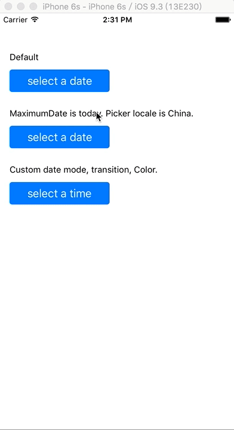

# UDatePicker

A date picker widget written in Swift. Easy to use and set a custom style if you need.

## Screenshot



## Installation

#### CocoaPods

```ruby
# for swift 4
pod 'UDatePicker', ~>'1.1.1'

# for swift 3
pod 'UDatePicker', ~>'1.0.0'

# for swift 2.3
pod 'UDatePicker', ~>'0.1.2'
```

#### Manual

Download `UDatePicker.swift` and add into your project.

## Usage

### Simple

```swift
class ViewController: UIViewController {
    let datePicker: UDatePicker?
    
    // ...
    
    func showDatePicker() {
        if datePicker == nil {
            datePicker = UDatePicker(frame: view.frame, willDisappear: { date in
                if date != nil {
                    print("select date \(date)")
                }
            })
        }
        
        datePicker.picker.date = NSDate()
        datePicker?.present(self)
    }
}
```

### Advance

`UDatePicker` is a child class of `UIViewController`. You can set custom transition when the date picker show.
      
`UDatePicker.picker` is a instance of `UDatePickerView` that is a child class of `UIView`. And You can get some view from its properties

    - datePicker: UIDatePicker
    - barView: UIView
    - doneButton: UIButton
    - blankView: UIView
    
Therefor, You can do anything what you want with them. 
    
For example:
    

```swift
// ...

// custom transition
datePicker.modalTransitionStyle = .FlipHorizontal

// custom date mode
datePicker.picker.datePicker.datePickerMode = .Time

// custom button text
datePicker.picker.doneButton.setTitle("OK", forState: .Normal)

// ...
```
